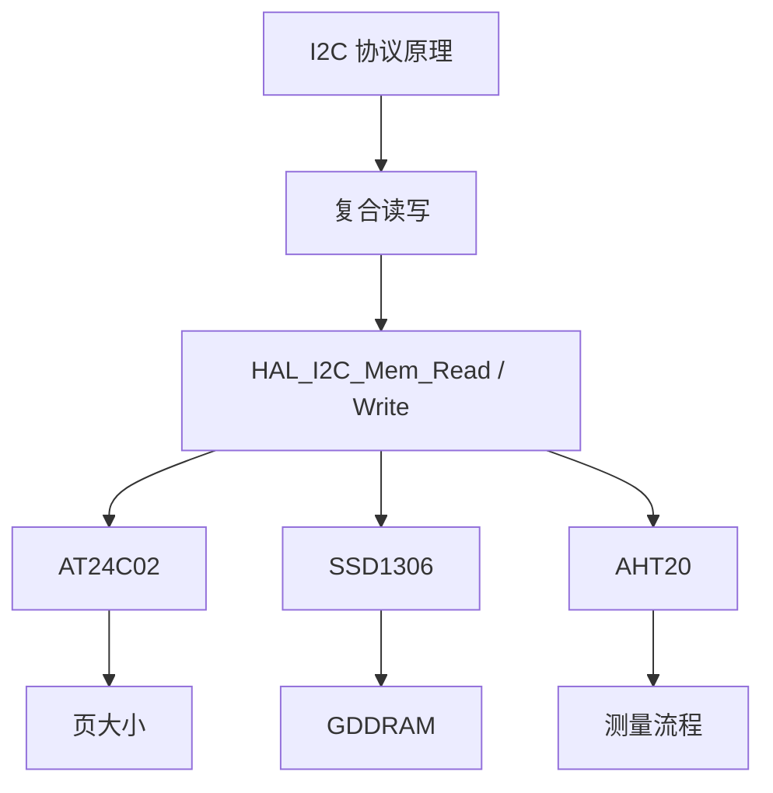
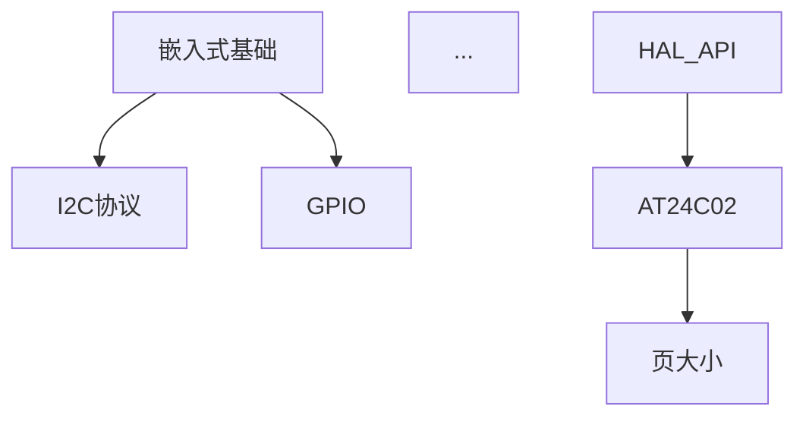

# 思考模块与知识图谱集成设计方案

**日期**: 2026-04-18
**状态**: � 已定稿（2026-04-18 采纳推荐默认值，§九 8 题均已决）
**提案人**: 用户 + AI（Cascade）

---

## 〇、TL;DR

把现有隐藏的 `concept_tag` 系统"显化"为用户可见的**关键词网络**，在 lesson 内和跨 lesson 两个尺度上帮助学习者建立知识体系。分 4 级递进累积：

| 级别 | 产物 | 粒度 | 载体 |
|------|------|------|------|
| L1 | **思考模块** | 每课 | `lesson-template.md` 新增子节 |
| L2 | **关键词索引要点总结** | 每课 | 升级现有"本节要点总结" |
| L3 | **章节知识图** | 每个主题（多课） | `lesson-integration-test-template.md`（Step ② 新建） |
| L4 | **课程级累积知识图** | 全课程 | 扩展 `course_overview_template.md` + `summary.md` 累积 |

---

## 〇·A、决策摘要（§九 8 题终局）

| # | 决策 | 影响面 |
|---|------|-------|
| Q1 | **(a)** 思考模块放在"掌握测试后、Reflection 前" | 模板布局 |
| Q2 | **(b)** 软约束——至少建议填 1 条，不阻塞进度 | 用户体验 |
| Q3 | **(b)** 预生成知识链条数按 concept_tag 动态，最多 5 条 | lesson 密度 |
| Q4 | **(b)** L4 Mermaid 图按 `learner_model.mastery_level` 过滤 | 长期可读性 |
| Q5 | **(b)** 模板与 glossary 同步改造（本次先起 A.2 再并入 B） | 实施顺序 |
| Q6 | **(b)** 先不写 `concept_graph_builder.py`，AI 手动维护 | 工程投入 |
| Q7 | **(b)** 不回填旧 003 session，新 session 享受新特性 | 一次性工作量 |
| Q8 | **(b)** 三引号 ``` 包代码块，单反引号 ` 才是关键词 | 批改细节 |

> 以上决策 2026-04-18 锁定。下一步进入阶段 **A.2** — `settings/glossary.md` 加 concept_tag 列。

---

## 一、背景与动机

### 1.1 学习者痛点

即使按现有模板学完 7 节课，用户脑子里仍是 7 块彼此孤立的知识块。例如 STM32 HAL 学完后：

- 用户记得 `HAL_I2C_Mem_Write`，也记得 AT24C02 有 8 字节页大小
- 但**问不出**"如果 `Size` 参数传 16 会触发什么原理？"
- **不是因为没讲**，是因为 lesson 是**线性展开**，从未显式把"API → 参数 → 硬件限制 → 失败后果"这条**因果链**呈现给学习者

### 1.2 现有机制的"隐藏资产"

项目里早就有 `concept_tag` 机制：
- 每个 Lesson 元信息里有 `**概念标签**: I2C、SDA、SCL、上拉电阻、...`
- 每个 `learner_model.concept_mastery` 按 concept_tag 记录掌握度
- 但**学习者从未见过这些标签**，它们只在 AI 内部流转

这是一个**被浪费的设计资源**——这些标签天然就是"知识点关键词"，只差一个"让用户看到并操作它们"的 UI。

### 1.3 用户提案原话

> 小测后面新添加思考模块，可用户自由提出问题。思考模块里面用 \` 包裹一个个知识点关键词，比如：`卷绕机制`、`内存覆盖`、`页大小`，方便学习者构建起自己的知识体系，或者逻辑链条。
>
> 知识点关键词可以在某个知识点章节串联起来，专门有一块是负责帮学习者用户把体系建立起来的。

用户的直觉正好指向了上面说的"隐藏资产"——concept_tag 的显化。

---

## 二、设计目标

| # | 目标 | 成功标准 |
|---|------|---------|
| 1 | 让 `concept_tag` 对学习者可见 | 每课 lesson 结尾展示本课所有 concept_tag 的中文化关键词 |
| 2 | 降低"提问"的启动阈值 | 思考模块预种 3 个关键词 + 1-2 条候选知识链，用户在此基础上接续 |
| 3 | 把"线性课程"升级为"网络课程" | 课程尾页（L4）能展示整门课的概念关系 Mermaid 图 |
| 4 | 不破坏现有教学流程 | 思考模块是增量节，不动精讲/训练/测试三大核心节 |
| 5 | 与 concept_tag / learner_model / review_queue 无缝集成 | 用户提的思考问题按关键词绑 concept_tag，直通既有机制 |

### 非目标（明确划出）

- ❌ 不引入"概念图手动编辑器"类 UI（过度工程）
- ❌ 不引入图数据库（Neo4j 等）——用 Markdown + Mermaid 纯文件表达
- ❌ 不自动生成"所有概念间所有可能关系"（组合爆炸；只生成 AI 在讲解中**实际用到**的关系）

---

## 三、核心设计：4 级集成

### 3.1 Level 1 — 每课思考模块

**位置**：`lesson-template.md` 中"掌握测试"之后、"Reflection"之前。

**完整结构**：

```markdown
## 思考模块（拓展问题 + 知识链条）

> **目的**：把本课孤立知识点"串"起来，发现你自己的盲点。
> **语法约定**：
>   - 关键词用**反引号**包裹（如 `卷绕机制`），AI 批改时会按关键词绑到你的学习者模型
>   - 问题越具体越好；"我有点懵"这种模糊描述会被 AI 追问

### 一、本课关键词索引（AI 预生成）

本课涉及的 {N} 个核心关键词：

- `HAL_I2C_Mem_Write`、`MemAddress`、`I2C_MEMADD_SIZE_8BIT`、`页大小`、`卷绕机制`、`内存覆盖`、`写入延时`

### 二、预生成的关键知识链（启发思考用）

AI 在讲解中用到的关系：

```
`页大小` ─(超出触发)→ `卷绕机制` ─(直接后果)→ `内存覆盖`
`HAL_I2C_Mem_Write` ─(含参数)→ `MemAddress` ─(字节数由)→ `I2C_MEMADD_SIZE_8BIT`
`AT24C02 写入` ─(必须延时)→ `写入延时 ≥ 5ms` ─(否则)→ `下一次写入失败`
```

### 三、你的问题（≥1 条，自由填写）

> 建议用反引号包裹问题涉及的关键词。

**问题 1**：

**问题 2**（可选）：

**问题 3**（可选）：

### 四、你的知识链（可选）

> 用 `概念A` → `概念B` → `概念C` 的形式写出你理解的关系。
> AI 批改时会对比预生成的链与你的链，指出差异。

**我理解的关系**：
```

**AI 预填规则**（`SKILL.md §4.2` 新增）：

1. **关键词索引**：从本课元信息的 `concept_tags` 字段自动展开。每个 concept_tag 按 `settings/glossary.md` 查中文名，找不到则用 lesson 讲解中出现的原词
2. **预生成知识链**：从讲解的结构中抽取——
   - "A → B"关系来自讲解中的"因为 A 所以 B"、"A 的结果是 B"等表述
   - 最多生成 5 条链，避免噪声
   - 每条链必须在讲解中**实际出现过**，禁止凭空推导
3. **问题数**：预留 3 个问题位，最少要求用户填 1 条

### 3.2 Level 2 — 关键词索引要点总结

**位置**：升级现有 `## 本节要点总结`。

**改造前**：

```markdown
## 本节要点总结

- HAL_I2C_Mem_Write：传入8位地址（含读写位），MemAddress是设备内部寄存器地址
- AT24C02 EEPROM：容量256字节，页面大小8字节，写入超过8字节会"卷绕"；写入后需等待5ms
- ...
```

**改造后**：

```markdown
## 本节要点总结

### 关键概念关系图（文本形式）

```
`HAL_I2C_Mem_Write` ─┬── `MemAddress`（设备内部寄存器地址）
                     ├── `MemAddSize`（地址字节数）
                     └── `Timeout`（超时阈值）

`AT24C02` ─→ `页大小(8B)` ─→ 超过 ─→ `卷绕机制` ─→ `内存覆盖`
                         └→ 写入后 ─→ `写入延时(5ms)`
```

### 详细说明

- **`HAL_I2C_Mem_Write`**：传入8位地址（含读写位），MemAddress是设备内部寄存器地址
- **`AT24C02` + `卷绕机制`**：容量256字节，页面大小8字节，写入超过8字节会卷绕；写入后需等待5ms
- ...
```

**设计要点**：
- 关系图用"文本树 + 箭头"而非 Mermaid（Mermaid 在 L3 用；L2 保持轻量）
- 每条详细说明条目开头用反引号关键词作为标签，视觉一致
- 禁止生成"关系图"里不存在的关键词——图必须是详细说明里关键词的**超集不成立/子集**

### 3.3 Level 3 — 章节综合知识图

**位置**：Step ② 的 `lesson-integration-test-template.md`（N.K+1 综合小测）。

**核心价值**：章节学完后，让学习者**先看图再做题**，用 Mermaid 图激活整章节记忆网络。

**结构**：

```markdown
## 本章节知识网络

> 学完 3.1 `AT24C02`、3.2 `SSD1306`、3.3 `AHT20` 后，你脑子里应该能还原下面这张图。



### 自查题（答对说明网络建起来了）

1. `HAL_API` 和 `复合读写` 之间是什么关系？
2. 三个外设（`AT24C02` / `SSD1306` / `AHT20`）共享哪一条边？为什么？
3. `页大小` 为什么是 `AT24C02` 独有而不是所有 I2C 设备共有的属性？

### 你的补充（可选）

请画出你认为图里缺少的关系或节点：

```

**生成规则**：
- Mermaid 图的节点 = 本章节所有 lesson 的 `concept_tag` 合集
- 边 = 从各 lesson 的 L2 关系图中聚合去重
- 自查题必须针对"边"（关系）而非"点"（单个概念）

### 3.4 Level 4 — 课程级累积知识图

**位置**：`course_overview_template.md` 新增一节。

**累积规则**：每完成一节 Lesson 后，`§4.5 进度更新`追加：
- 本课新引入的 concept_tag → 加节点
- 本课 L2 关系图里的所有边 → 加边

**结构**：

```markdown
## 知识体系全景图（随学习累积）

> 最后更新：2026-04-20（Lesson 3.4 完成时）
> 节点数：42 / 边数：58



### 用户问题链汇总（从各课思考模块导出）

| 课时 | 用户问题摘要 | 涉及关键词 | AI 解答引用 |
|------|-------------|----------|-----------|
| L3 思考模块 | `卷绕机制` 和 `内存覆盖` 是同一件事吗？ | `卷绕机制`、`内存覆盖` | [见 L3 对话 §2] |
| ... | ... | ... | ... |
```

**衍生产物**（可选，未来优化）：
- 课程结束后从 mermaid 文本生成 PNG/SVG，作为"学习地图"交付用户
- 可用 `scripts/indexer/render_concept_graph.py`（未来工具）

---

## 四、概念命名规范（关键）

三套命名要严格对齐，否则会乱。

| 名称 | 形式 | 例子 | 出现位置 |
|------|------|------|---------|
| **concept_tag** | 机器 slug（英文 + 连字符 + 小写） | `stm32-eeprom-page-wrap` | lesson 元信息、learner_model、prereq-map |
| **关键词（Keyword）** | 中文或英文自然词（短） | `卷绕机制` / `HAL_I2C_Mem_Write` | L1 思考模块、L2 要点、L3/L4 Mermaid 节点 |
| **术语（Term）** | 中文标准名 + 定义 | 条目：`卷绕机制：EEPROM 超出页大小时...` | `settings/glossary.md` |

**映射规则**：
- 每个 concept_tag ↔ 唯一关键词 ↔ 唯一术语条目（1:1:1）
- 生成 lesson 时，AI 必须在元信息里写 `concept_tags:` 的同时写 `concept_keywords:`（中文可读），两者数量相等顺序对应
- 术语表 `glossary.md` 新增列 `concept_tag` 便于反查

**示例元信息**：

```yaml
concept_tags: [stm32-hal-i2c-mem-write, at24c02, eeprom-page-wrap]
concept_keywords: [HAL_I2C_Mem_Write, AT24C02, 卷绕机制]
```

---

## 五、与现有系统的交互点

### 5.1 与 `learner_model.concept_mastery`

思考模块里用户提的问题，AI 批改时按反引号提取关键词 → 映射到 concept_tag → 更新 learner_model：

```json
{
  "concept_mastery": {
    "stm32-eeprom-page-wrap": {
      "mastery_level": "developing",
      "user_questions": [                     // 新字段
        {
          "lesson": "3",
          "question": "卷绕机制和内存覆盖是同一件事吗？",
          "raised_at": "2026-04-20T10:00:00+08:00",
          "resolved": true
        }
      ]
    }
  }
}
```

**设计决定**：不改 schema（保持 v2.2 兼容），把 `user_questions` 作为可选字段；旧 session 没有该字段时默认视为空数组。

### 5.2 与 `review_queue.json`

用户的思考问题如果 AI 判定"需要复习才能真正理解"（例如涉及已学但掌握度薄弱的 concept_tag），自动加入复习队列：

```json
{
  "id": "review_042",
  "lesson": 3,
  "source": "thinking_module",           // 新枚举值
  "question": "卷绕机制和内存覆盖的层次关系是什么？",
  "topic_tag": "stm32-eeprom-page-wrap",
  "first_raised_at": "2026-04-20",
  "next_review_at": "2026-04-23",
  "status": "pending"
}
```

### 5.3 与 `summary.md`

`summary.md` 新增"累积关键词与用户问题"节，每课追加。

### 5.4 与 Reflection（职责拆分）

| 节 | 关注点 | 保留问题 |
|---|------|---------|
| 思考模块（新） | **内容** 延伸、关系思考、盲点发现 | "你还想问什么？""关系链有没有问题？" |
| Reflection（瘦身） | **元认知**、主观感受 | "认知难度 1-5？""Worked Example 帮到你吗？" |

**拆分动作**：
- Reflection 删除 "哪些部分需要澄清？"（这个问题移到思考模块的"你的问题"）
- 保留认知难度打分和对教学方式的反馈

### 5.5 与 `glossary.md`

新增列 `concept_tag`，让术语表变成三者的权威映射源。

---

## 六、数据流图

```
[用户填思考模块]
    ↓ (反引号关键词 + 问题)
[AI 批改]
    ↓ 提取关键词 → 映射 concept_tag
    ↓
[按 concept_tag 更新 learner_model.user_questions]
    ↓
[判定是否入复习队列 (弱掌握的 concept_tag)]
    ↓
[更新 summary.md 的"累积关键词与用户问题"]
    ↓
[累积到 course_overview 的 L4 知识图]
```

---

## 七、与其他提案的协同

### 7.1 与 Step ② 章节扩展

- L3 天然落入 `lesson-integration-test-template.md`（Step ② 新建）
- 子课 `lesson_3_1_eeprom.md` 的思考模块聚焦本子课（少但精）
- 综合小测 `lesson_3_4_integration.md` 聚合前 3 个子课的关系图

### 7.2 与 Step ③ 问题索引式

- 思考模块的"自由提问"是 **用户主导**的问题生成
- 问题索引式是 **AI 主导**的问题出题
- 两者**互补**：用户提的问题暴露薄弱 concept_tag → 问题索引式课的题库从中抽题
- 长期目标：学习者模型收集够多的"用户问题样本"后，AI 能基于用户的**提问模式**调整教学

### 7.3 与 Step ① 图索引（已完成）

- 用户在思考模块提到某个关键词时，可以**关联资料原图**
- AI 批改时若 `image_index.json` 里有该关键词的高匹配度原图，可引用佐证
- 形成"关键词 ↔ 原图"的双向锚点

---

## 八、实施路径（阶段分解）

### 阶段 A：文档 + 映射规范（本文档 + glossary 改造）

- **A.1** 本设计文档完成（当前）
- **A.2** `settings/glossary.md` 加 concept_tag 列，把现有 7 节课涉及的术语全部整理进去
- **产物**：三套命名的权威映射表

### 阶段 B：L1 + L2（每课级别）

- **B.1** 升级 `lesson-template.md`：加思考模块 + 改造要点总结
- **B.2** SKILL.md §4.2 加 L1/L2 生成规则（含预填机制）
- **B.3** SKILL.md §4.3 加 L1 批改规则（提取关键词 → 绑 concept_tag）
- **B.4** lesson 元信息加 `concept_keywords` 字段

### 阶段 C：L3（章节级别，与 Step ② 合并）

- **C.1** 新建 `lesson-integration-test-template.md`（内建 Mermaid 章节图）
- **C.2** SKILL.md §4.2 加 L3 生成规则

### 阶段 D：L4（课程级累积）

- **D.1** 升级 `course_overview_template.md` 和 `summary-template.md`
- **D.2** SKILL.md §4.5 加"累积 concept graph"规则
- **D.3**（可选）`scripts/indexer/concept_graph_builder.py` 从 session 自动生成完整 mermaid

### 阶段 E：验证 & 迭代

- **E.1** 对 003 session 的 1 节课做试点重生成，观察 L1+L2 效果
- **E.2** 收集用户反馈，可能调整预填密度、关键词数量上限等参数

---

## 九、开放问题（已定稿）

> ✅ **2026-04-18 决策**：8 题均采纳推荐默认值，每题已在下文标记「已决」。详见文首 §〇·A 决策摘要。

### Q1: 思考模块的位置

选项：
- ✅ **已决** — (a) 掌握测试之后、Reflection 之前（趁热打铁）
- (b) 要点总结之后、Reflection 之前
- (c) Reflection 之后，作为"课末延伸"

**讨论点**：(a) 让思考紧跟测试，趁热打铁；(c) 和要点总结前后夹击 Reflection 的元认知段，更凝聚。

### Q2: 思考模块的必填程度

选项：
- (a) 至少填 1 条问题才能进入下一课（硬约束）
- ✅ **已决** — (b) 建议填写但不阻塞下一课（软约束）
- (c) 完全可选，用户可以整段跳过

**讨论点**：太硬可能被用户觉得"增加负担"，太软就会被跳过没人用。

### Q3: AI 预填的知识链条数上限

选项：
- (a) 固定 3 条
- ✅ **已决** — (b) 按 concept_tag 数量动态，最多 5 条
- (c) 不预填，让用户完全自由生成

**讨论点**：(c) 启动阈值太高；(a)/(b) 之间看 lesson 密度。

### Q4: L4 的 Mermaid 图规模上限

选项：
- (a) 所有节点都显示（可能会超过 100 节点，图变乱）
- ✅ **已决** — (b) 按 `learner_model.mastery_level` 过滤，只显示"已掌握"和"待攻克"的
- (c) 折叠为"二级地图"——主节点 + 子图展开

**讨论点**：STM32 全栈 7 节课 = 约 50 个 concept_tag；再多就需要 (c)。

### Q5: 术语表 glossary.md 改造时机

选项：
- (a) 先做 glossary 改造（阶段 A.2），再做模板（阶段 B）
- ✅ **已决** — (b) 模板 + glossary 同步做（本次先起 A.2 骨架，再与模板改造合流进入 B）
- (c) 先做模板临时用讲解原词，glossary 后补

**讨论点**：(a) 最干净但前置工作量大；(c) 启动快但后续要批量回填。

### Q6: 是否引入可选工具 `concept_graph_builder.py`

选项：
- (a) 做，自动从 session 数据生成 Mermaid（阶段 D.3）
- ✅ **已决** — (b) 不做，AI 每次手动维护 Mermaid 源文本（出现漂移后再引入工具）

**讨论点**：自动生成避免 AI 漂移，但工具本身要写+测。

### Q7: 对旧会话（003 session）如何处理

选项：
- (a) 自动回填思考模块到已生成的 lesson（一次性改 7 个文件）
- ✅ **已决** — (b) 不回填，旧 session 保持现状，新 session 享受新特性（与 Step ① 同策略）
- (c) 等用户真的回到旧 session 时再动态补

### Q8: 关键词反引号的边界情况

问题：如果用户在思考模块里写 `void HAL_I2C_Mem_Write(...)`（代码），AI 怎么区分 "代码" 和 "关键词"？

选项：
- (a) 反引号的内容全部视为关键词尝试匹配 concept_tag；匹配不上则忽略
- ✅ **已决** — (b) 用户需用 ```` ``` ```` 三引号包代码块，单反引号才是关键词
- (c) AI 批改时自然语言判断（有开销）

---

## 十、成功衡量

实施后，每月自动检查：

| 指标 | 目标值 | 数据源 |
|------|-------|--------|
| 思考模块完成率 | ≥ 60% 课有用户填写 | 扫描 lesson 文件 |
| 每课平均问题数 | ≥ 1.5 | 统计思考模块问题数 |
| 关键词反引号使用率 | ≥ 70% 问题含反引号关键词 | 正则统计 |
| concept_tag 覆盖率 | L4 知识图含 ≥ 90% 的已学 concept_tag | learner_model vs course_overview |
| 用户发起的复习条目占比 | ≥ 20% 来自 `source: "thinking_module"` | review_queue.json |

低于目标时回看开放问题的决策是否需要调整。

---

## 十一、不做的事（划边界）

- ❌ 不做"知识点推荐系统"（根据用户历史推荐下一个该学的关键词）——交互复杂度太高
- ❌ 不做"协作思考"（多用户共享概念图）——非本项目目标
- ❌ 不做"概念图可视化编辑器"——Markdown + Mermaid 是唯一呈现
- ❌ 不做"关键词自动抽取"（从 lesson 讲解里 NLP 抽关键词）——每个 concept_tag 仍由 AI 生成时显式声明

---

## 附录 A：示例对比

### 旧版 Lesson 3（lesson_3.md 节选）

```markdown
## 本节要点总结

- HAL_I2C_Mem_Write：传入8位地址...
- AT24C02 EEPROM：容量256字节，页面大小8字节...

## Reflection

1. **认知难度** (1-5)：
2. **HAL_I2C_Mem_Write 和 HAL_I2C_Master_Transmit 的区别是什么？**
3. **AT24C02的页面大小是8字节，如果写入9字节会发生什么？**
```

### 新版 Lesson 3（应用 L1+L2 后）

```markdown
## 思考模块（拓展问题 + 知识链条）

### 本课关键词索引

- `HAL_I2C_Mem_Write`、`MemAddress`、`I2C_MEMADD_SIZE_8BIT`、`页大小`、`卷绕机制`、`内存覆盖`、`写入延时`

### 预生成知识链

```
`页大小` → (超出触发) → `卷绕机制` → (直接后果) → `内存覆盖`
`HAL_I2C_Mem_Write` → (含参数) → `MemAddress` → (字节数由) → `I2C_MEMADD_SIZE_8BIT`
```

### 你的问题

**问题 1**：

**问题 2**（可选）：

## 本节要点总结

### 关键概念关系图

```
`HAL_I2C_Mem_Write` ─┬── `MemAddress`
                     ├── `MemAddSize` ← `I2C_MEMADD_SIZE_8BIT`
                     └── `Timeout`

`AT24C02` ─→ `页大小(8B)` ─→ 超过 ─→ `卷绕机制` ─→ `内存覆盖`
                         └→ 写入后 ─→ `写入延时(5ms)`
```

### 详细说明

- **`HAL_I2C_Mem_Write`**：传入8位地址...
- **`AT24C02` + `卷绕机制`**：...

## Reflection（瘦身版）

1. **认知难度** (1-5)：
2. **Worked Example 有没有帮你理解"为什么"？**
```

---

## 附录 B：术语表改造示例

### 改造前（`settings/glossary.md`）

```markdown
| 中文 | 英文 | 定义 |
|-----|------|------|
| 卷绕 | wrap | EEPROM 超出页大小时数据覆盖页首 |
```

### 改造后

```markdown
| concept_tag | 中文关键词 | 英文 | 定义 | 首次出现 |
|-------------|-----------|------|------|---------|
| stm32-eeprom-page-wrap | 卷绕机制 | page wrap | EEPROM 超出页大小时数据覆盖页首 | Lesson 3 |
```

---

## 十二、下一步

§九 已定稿。进入实施：

1. ✅ 用户回答"开放问题"§9 的 8 个 Q（2026-04-18 完成）
2. ✅ 根据回答更新本文档相应章节（2026-04-18 完成）
3. ⏩ **当前进行**：阶段 **A.2** — 改造 `settings/glossary.md` 加 concept_tag 列
4. 之后按阶段 A→B→C→D→E 顺序推进（阶段 C 与 Step ② 合流）
5. 每阶段结束做一次对话 checkpoint
